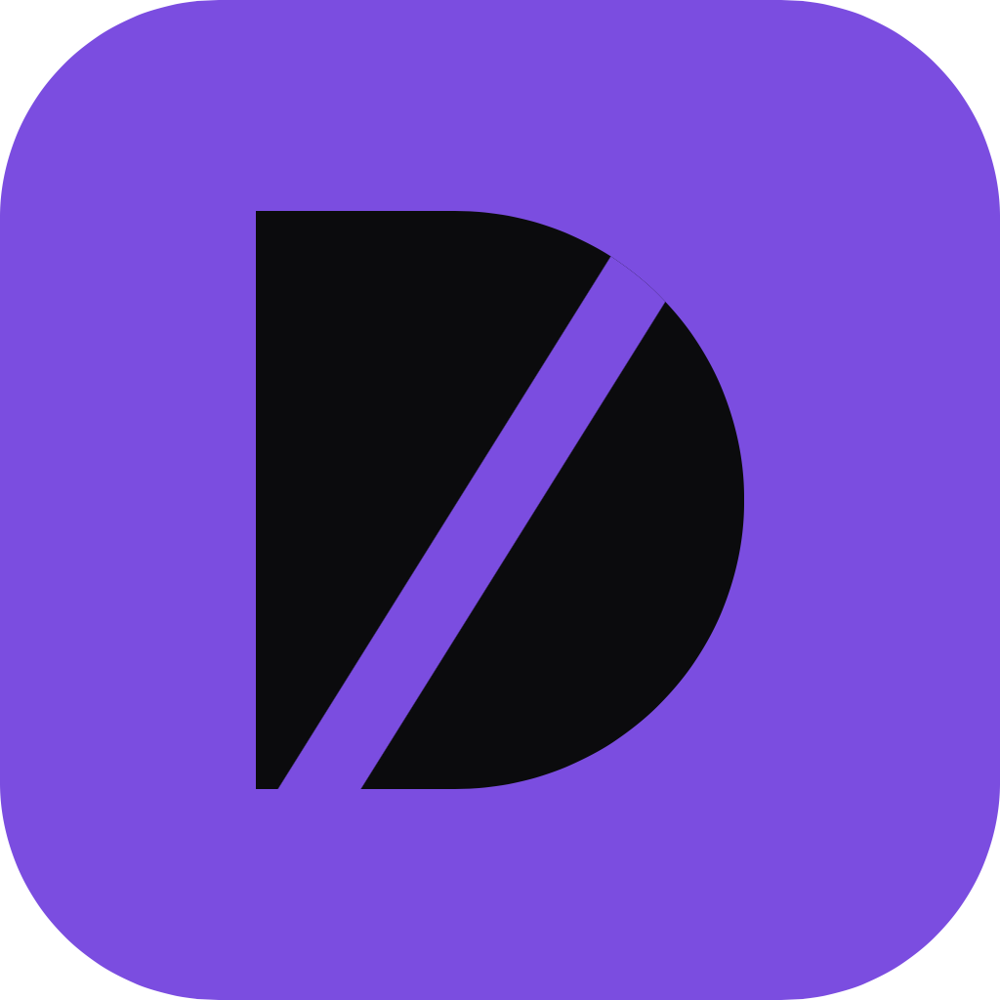
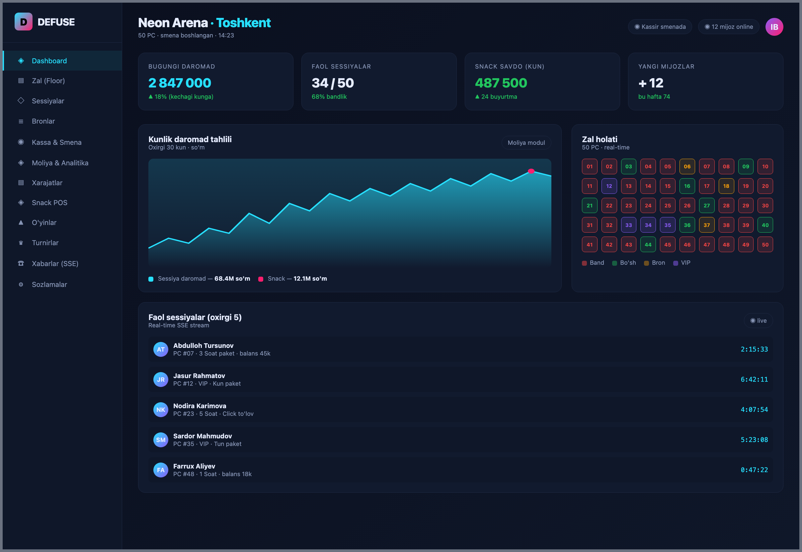
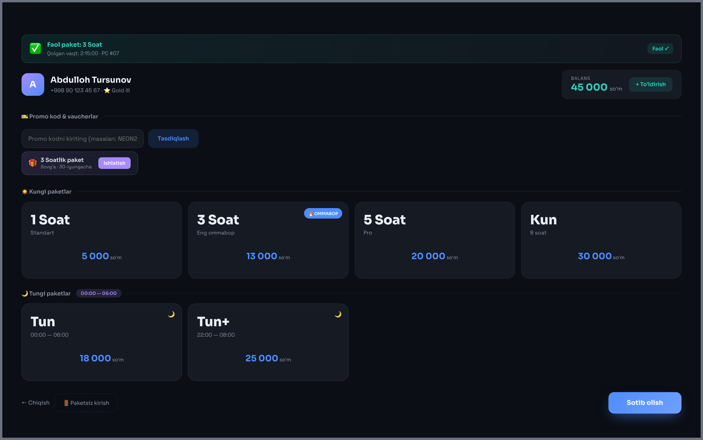
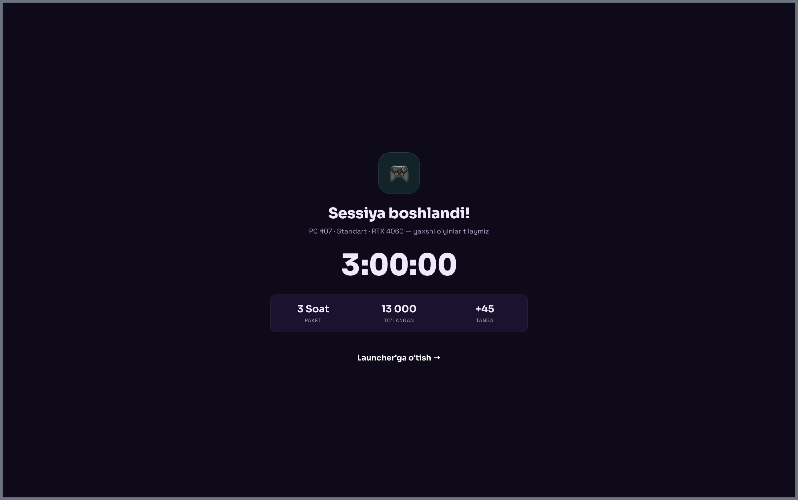
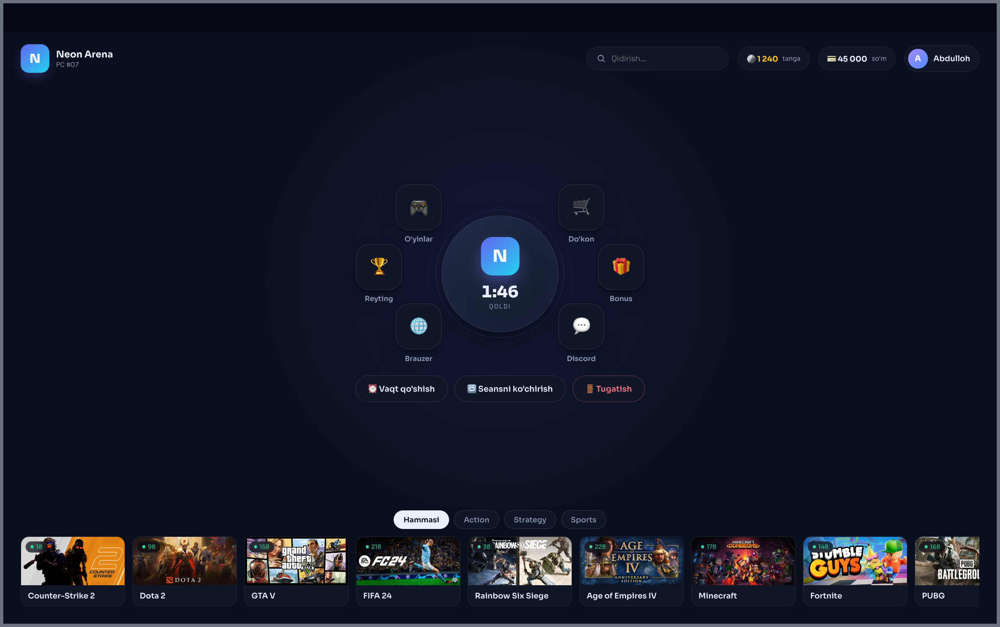
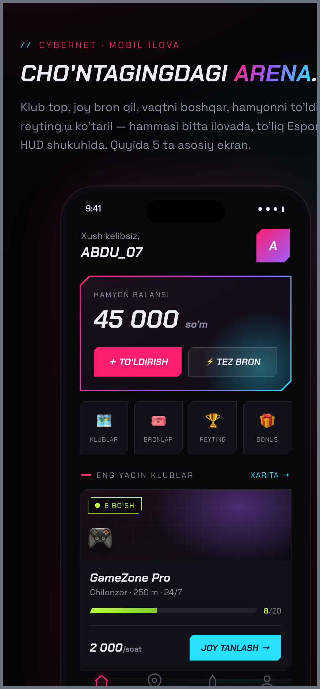
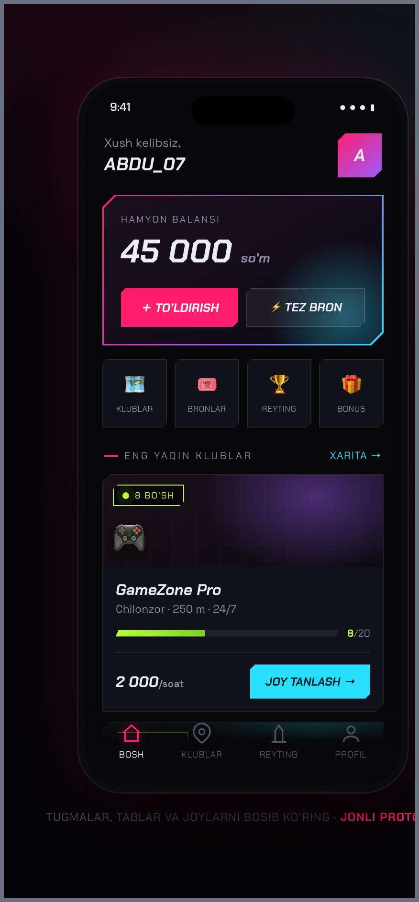
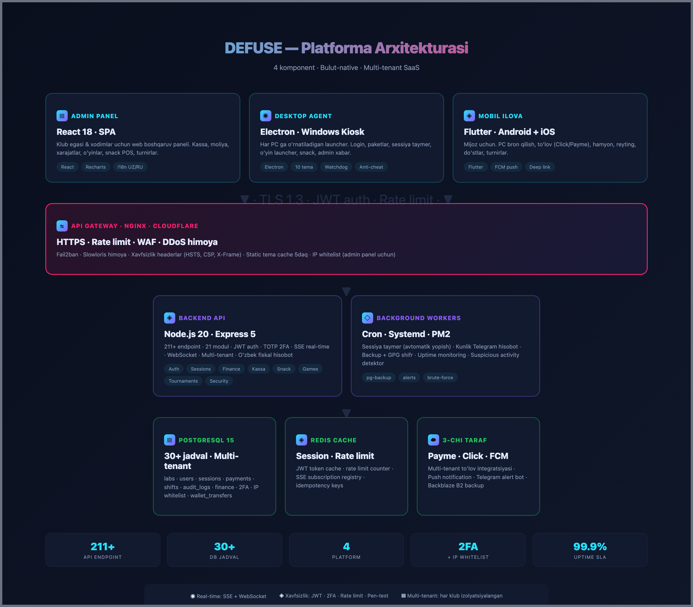

<div align="center">
  

  <h1>DEFUSE</h1>
  <h3>Gaming Center Cloud — Multi-tenant SaaS for Uzbekistan</h3>

  <p>
    
    
    
    
  </p>

  <p><b>defuse.uz</b> · President Tech Award 2026 · Enterprise · MVP · Made in Uzbekistan</p>
</div>

---

## O'zbekcha

**Defuse** — O'zbekistondagi kompyuter klublari va gaming markazlari uchun ishlab chiqilgan **birinchi mahalliy to'liq SaaS platforma**. Klub egasi bitta oyning to'lovi bilan 50 gacha PC'ni, kassani, moliyani, xarajatlarni, snack POS ni, o'yinlarni, turnirlarni va foydalanuvchilarni yagona web-panel orqali boshqaradi.

**Nima uchun kerak:**
- ⚠️ Bugun O'zbekistonda 500+ klub chet el yechimini (iSafeCloud, GGLeap, SmartLaunch) ishlatadi → yiliga $150 000+ valyuta chetga chiqadi.
- ⚠️ O'zbek tili, Payme/Click, o'zbek fiskal hisobot — chet el mahsulotlarida yo'q.
- ✅ Defuse mahalliy, to'liq stack, xavfsiz va arzon.

## English

**Defuse** is the **first Uzbek-made full-stack SaaS platform** for computer gaming centers. One subscription, and the club owner runs 50 PCs, the cashier, finance, expenses, snack POS, games, tournaments, and customer database from a single web panel.

**Why it matters** — 500+ clubs in Uzbekistan currently pay in USD to foreign vendors that ship no Uzbek localization, no Click/Payme integration, no local tax reporting, and no timezone-aligned support. Defuse fills that gap.

---

## Screenshots

<table>
<tr>
<td width="50%"><b>Admin Panel — Dashboard</b><br/><i>Klub egasi uchun real-time boshqaruv paneli</i><br/></td>
<td width="50%"><b>Desktop Agent — Paketlar</b><br/><i>Mijoz PC oldida paket tanlaydi va to'laydi</i><br/></td>
</tr>
<tr>
<td><b>Desktop Agent — Sessiya taymer</b><br/><i>Live taymer, balans, snack, admin xabar</i><br/></td>
<td><b>Desktop Agent — O'yin launcher</b><br/><i>Backend'dan yuklanadigan katalog, 65+ o'yin</i><br/></td>
</tr>
<tr>
<td><b>Mobile App — Bosh sahifa</b><br/><i>Hamyon, tez bron, klublar ro'yxati</i><br/></td>
<td><b>Mobile App — Klub tafsiloti</b><br/><i>Seat map, paket tanlash, Click/Payme to'lov</i><br/></td>
</tr>
</table>

## Architecture



## Tech Stack

| Layer | Technology |
|---|---|
| **Backend API** | Node.js 20 · Express 5 · PostgreSQL 15 · Redis · WebSocket · SSE |
| **Authentication** | JWT · bcrypt · TOTP 2FA · token versioning (revocation) |
| **Admin Panel** | React 18 · Recharts · Axios · i18n UZ/RU |
| **Desktop Agent** | Electron · Windows kiosk lockdown · watchdog auto-restart · 10 selectable themes |
| **Mobile App** | Flutter 3 · Dart · deep linking · biometric login |
| **Payments** | Click (multi-tenant) · Payme (multi-tenant) — funds land directly in each club's account |
| **Notifications** | Firebase Cloud Messaging · Telegram bot alerts |
| **Deploy** | Nginx + Cloudflare · systemd + PM2 · fail2ban · Let's Encrypt · daily GPG-encrypted backups |

## Repository Layout

```
backend/         Node.js REST API + WebSocket server (211+ endpoints, 30+ tables)
admin-panel/     React dashboard for club owners and staff
desktop-agent/   Electron kiosk launcher for gaming PCs (10 UI themes)
mobile_app/      Flutter customer app (iOS, Android)
.github/         Screenshots, wordmark, workflows
```

## Product Highlights

- 🏢 **Multi-tenant SaaS** — one server hosts many clubs, fully isolated
- 💳 **Multi-tenant payments** — Click/Payme funds land in each club's own account (we take no cut, no middleman)
- 🎨 **10 selectable UI themes** for the desktop agent — club owner picks their brand
- 🔒 **Security-hardened** — 40+ attack vectors penetration-tested, TOTP 2FA, IP allowlist, brute-force detection, dual-approval refunds
- 👶 **Age gating** — 18+ games (GTA, Cyberpunk, Witcher) require admin unlock — Uzbek family-values compliant
- 🇺🇿 **Localized** — full O'zbek + Ru language, Uzbek fiscal reports (Z/X reports)
- 📊 **Live dashboard** — real-time SSE stream, daily Telegram summary
- ⚡ **Battle-tested** — 10 concurrent PC simulator, 10-persona real-gamer UX test

## Getting Started (Showcase)

> ⚠️ This repository is a **public showcase copy**. Secrets, real IPs, and payment credentials are removed. For full source access, licensing, or a live demo — see contact below.

```bash
# Backend
cd backend
cp .env.example .env    # fill in JWT_SECRET, DB_URL, etc.
npm install
npm run migrate
npm start               # localhost:3000

# Admin panel
cd admin-panel
npm install
npm start               # localhost:3001

# Desktop agent
cd desktop-agent
npm install
npm start               # Electron kiosk window

# Mobile app
cd mobile_app
flutter pub get
flutter run
```

## Metrics

| Metric | Value |
|---|---|
| Backend API endpoints | **211+** |
| PostgreSQL tables | **30+** |
| Platforms shipped | **4** (Web · Windows · Android · iOS) |
| Selectable launcher themes | **10** |
| Attack vectors penetration-tested | **40+** |
| Real-gamer UX test personas | **10** |
| Production uptime SLA | **99.9%** |
| Estimated market (Uzbekistan) | **500+ clubs · $2.5M SOM** |

## Roadmap

- **Q4 2026** — MVP ready · Pilot with 5 clubs in Tashkent
- **Q1 2027** — 20 clubs · Marketing launch · Sales team
- **Q2 2027** — 50 clubs · Franchise program · Tournament platform
- **Q3 2027** — 100 clubs · Kazakhstan expansion
- **Q4 2027** — 200 clubs · Kyrgyzstan · Enterprise API
- **Q2 2028** — 500 clubs · Regional leader

## Status

**This is a public showcase.** Full source, live production URLs, and deployment secrets are in a private mirror. Contact for licensing, pilot programs, or partnership.

## Contact

- 🌐 Web — **defuse.uz** (coming soon)
- 📧 Email — **ibektosh3@gmail.com**
- 💼 GitHub — [ibektosh3-lgtm](https://github.com/ibektosh3-lgtm)

---

<div align="center">
  <sub>© 2026 Defuse Team · Made in Uzbekistan 🇺🇿 · Business Source License 1.1</sub>
</div>
