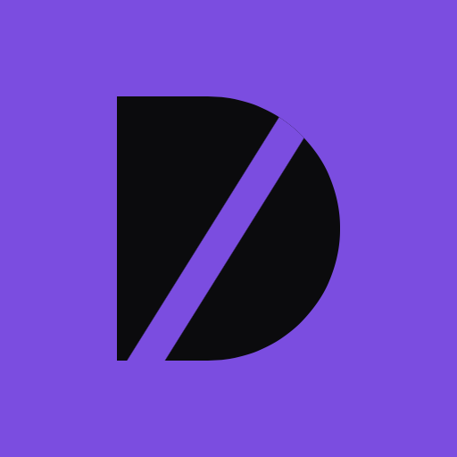

<div align="center">
  
  <h1>Defuse</h1>
  <p><strong>Kiberkafe Boshqaruv Platformasi — Gaming Center Management Platform</strong></p>
</div>

---

## O'zbek tilida

**Defuse** — kompyuter klublar va kiberkafelar uchun to'liq bulut asosidagi boshqaruv tizimi.

Platforma sessiya nazorati, to'lovlar, mijozlar bazasi, o'yinlar katalogi, snack-bar POS va kiberport turnirlar modulini yagona tizimda birlashtiradi.

**Asosiy imkoniyatlar:**

- Kompyuter va sessiyalarni real-time boshqarish (Electron desktop agent)
- Admin panel — kassa, statistika, xodimlar, aksiyalar, sovg'alar
- Mobil ilova (Flutter) — bron qilish, hamyon, do'stlar, turnirlar
- To'lov integratsiyalari: Click, Payme, Uzum, Apelsin, Anor
- Multi-tenant arxitektura (bir necha klublar bitta serverda)
- IP-oq ro'yxat, 2FA, audit log, xavfsizlik boshqaruvi

## In English

**Defuse** is a full-stack SaaS management platform for gaming centers and cyber cafes.

**Key features:**

- Real-time PC and session control via Electron desktop agent
- React admin panel — POS, analytics, staff, promotions, loyalty rewards
- Flutter mobile app — bookings, wallet, friends, tournaments, leaderboard
- Payment gateway integrations (Click, Payme, Uzum, Apelsin, Anor)
- Multi-tenant architecture (many clubs on a single server)
- IP allowlist, TOTP 2FA, audit logs, security hardening

---

## Tech Stack

| Layer | Technology |
|---|---|
| Backend API | Node.js, Express 5, PostgreSQL, Redis, WebSocket |
| Auth | JWT, bcrypt, TOTP 2FA |
| Admin panel | React 18, React Router, Axios |
| Desktop agent | Electron, electron-updater, Windows lockdown |
| Mobile app | Flutter 3, Dart |
| Payments | Click, Payme, Uzum, Apelsin, Anor |
| Push | Firebase Cloud Messaging |
| Deploy | PM2, Nginx, Cloudflare |

## Repository Layout

```
backend/         Node.js REST API + WebSocket server
admin-panel/     React dashboard for club owners and staff
desktop-agent/   Electron kiosk launcher for gaming PCs
mobile_app/      Flutter customer app (iOS, Android)
```

---

## Status

This is a showcase version. All secrets and server addresses replaced with placeholders.

**Contact for full access, licensing, or a live demo · defuse.uz**
